# Elaborato esame di stato 2019/20

> Zhu Yihui 5A Informatica

> [Sito finale](https://todo-webapp-react.herokuapp.com/)

> [Repository codice sorgente front-end](https://github.com/Aehronburn/todo-webapp)

> [Repository codice sorgente back-end](https://github.com/Aehronburn/todo-webapp-api)

# Progetto: **Todo**

- [Analisi](##Analisi)
- [Progettazione](##Progettazione)
- [Implementazione](##Implementazione)
- [Testing e Debugging](##testing-e-debugging)
- [Deployment](##Deployment)
- [Criticità e miglioramenti futuri](##criticità-e-miglioramenti-futuri)

---

## Analisi

Per l'esame di stato è stato scelto di approfondire gli argomenti riguardanti:

- sviluppo di applicazioni web
- architettura client-server di livello 3
- virtualizzazione.

A tal proposito è stato realizzato un progetto consistente in una webapp che implementa gli argomenti prima elencati finalizzata alla gestione delle faccende ed impegni familiari da sbrigare.

I vari task possono essere raccolti e organizzati in collezioni divise per categoria e sono mostrati in una tabella, da cui l'utente può crearne di nuovi, segnarne l'adempimento od eliminarlo.

Tutti i dati sono salvati in cloud, inoltre i task creati mostrano anche l'orario di creazione e l'utente.

La riservatezza delle informazioni è garantita da un sistema di autenticazione e autorizzazione basata su password cifrate.

---

## Progettazione

- [Architettura generale](###architettura-generale)
- [Struttura front-end, web server](###struttura-front-end,-web-server)
- [Struttura back-end, application server](###struttura-back-end,-application-server)
- [Database](###Database)
- [User interface design](###user-interface-design)


### Architettura generale

L'architettura dell'applicazione è quella _client-server tier 3_, in cui il software viene scomposto in tre livelli o strati:

1. Presentazione (interfaccia utente)
1. Applicazione (funzionalità)
1. Dati (database)

Il vantaggio di questo schema è che la complessità della realizzazione e del debugging diminuisce, perchè il programma viene diviso in moduli più semplici.

Non solo, il singolo livello può essere aggiornato indipendentemente dagli altri, garantendo scalabilità e riusabilità del codice.

Infine, quando ciascun livello viene ospitato su macchine hardware differenti duplicate, viene migliorata la disponibilità, perché il carico di lavoro viene distribuito su altri nodi in casi di fallimento di uno.

I provider cloud che offrono servizi di hosting effettuano la cosiddetta _virtualizzazione_ nei loro server. La virtualizzazione consiste nel condividere la macchina fisica e le sue risorse con più sistemi operativi separati tra loro.

Questo permette di aumentare l'efficienza delle infrastrutture, perché se in un server fisico risiedesse un solo server software quest'ultimo userebbe solo una piccola parte delle risorse. Ancora peggio se il servizio non viene invocato, la macchina fisica sarebbe letteralmente sprecata perché non lavora, occupando spazio.

Un'altro vantaggio per gli utenti è che i provider possono offrire sistemi operativi differenti, adattandosi così alle necessità di una specifica applicazione. Inoltre, non essendo i server virtuali altro che dei file, le procedure di backup e disaster recovery sono semplici ed immediate.

Quando è presente un hypervisor, un manager di tutti i server virtuali presenti nelle macchine fisiche, è possibile effettuare il cosiddetto _load balancing_, diminuire o aumentare l'allocazione di risorse dinamicamente a seconda del carico di lavoro

### Struttura front-end, web server

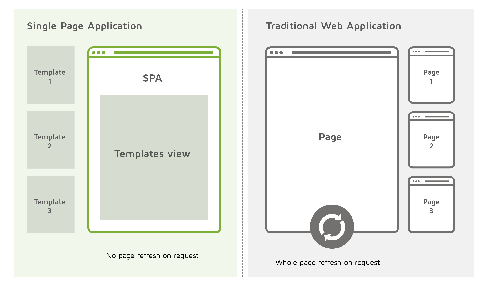

_Source: Digital Clarity Group_

La parte di presentazione è costituita da una single-page-application, cioè una applicazione costituita da una solo pagina statica che ottiene i dati attraverso chiamate asincrone al server e sfrutta la renderizzazione condizionale per la parte ottenere dinamicità. Una webapp o un sito web tradizionale al contrario richiedono che il server spedisca al client intere pagine html, con grande dispendio di tempo e banda.

Ciò le permette di non generare caricamenti della pagina quando si cambiano schermate o si richiedono contenuti a parte quello iniziale, il tutto a favore della velocità e dell'esperienza d'uso.

### Struttura back-end, application server

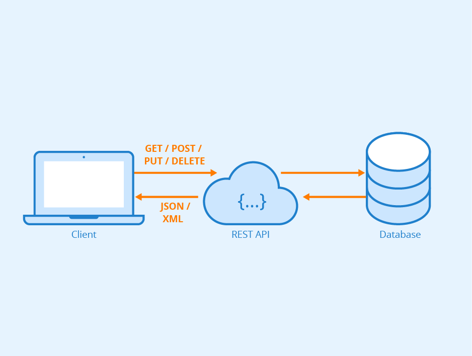

_Source: TheAbbie_

Come servizio di back-end è stato scelto una Rest(Representational State Transfer) API, ovvero un API basata sul protocollo HTTP, quindi _stateless_, che associa ad un URL una risorsa(che viene restituita sottoforma di JSON o XML), che il richiedente del servizio deve richiedere inviando una richiesta HTTP specificandone la tipologia, GET POST DELETE etc.

> _stateless_ : il server non crea sessioni, cioè non memorizza il contesto del client. Ciascuna richiesta deve quindi contenere tutte il necessario per il buon fine della chiamata.

### Database

;

_Source: WP Epitome_

Come base di dati per memorizzare l'elenco degli utenti e la lista delle faccende è stato deciso di usare il un DBMS NoSQL a documenti.

NoSQL sta per Not Only SQL e indica un insieme di DBMS che non utilizzano né il linguaggio SQL né il modello relazionale, nati allo scopo di servire delle specifiche necessità che i rigidi schemi delle tabelle non possono soddisfare.

Ci sono per esempio database _chiave/valore_, particolarmente veloci e adatti a servizi di messaggistica istantenea, _a grafo_, tipici dei social network, _in memoria_, per videogiochi online in quanto offrono tempi di latenza ridottissimi. In genere i DBMS NoSQL permettono la scalabilità orizzontale, cioè l'aggiunta di nuovi nodi al gruppo di elaboratori(molto vantaggioso), contro la scalabilità verticale, ovvero potenziare il singolo elaboratore.

I database _a documenti_ memorizzano i dati sottoforma di documenti raccolti a loro volta in collezioni(le tabella dei RDBMS), l'equivalente del record nei database relazionali, di fatto oggetti JSON, caratterizzati da uno schema libero e mutabile, che possono essere messi in relazione o contenerne altri documenti.

Il motivo della scelta è dovuto alla semplicità di programmazione, in quanto un documento del database ha la stessa struttura nel codice del programma.
Lo schema non fisso inoltre garantisce flessibilità e scalabilità nel futuro.
Infine, siccome i dati non sono normalizzati, le prestazioni sono migliori che nei RDBMS in quanto quest'ultimi normalmente necessitano di effettuare ed attendere l'operazione JOIN tra le tabelle per ottenere il risultato richiesto, a scapito di eventuali ridondanze.

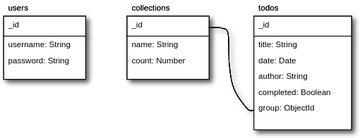

### User interface design

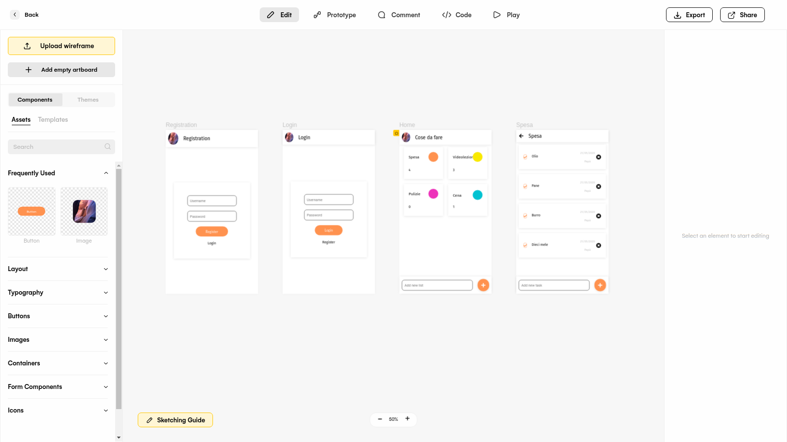

Si è iniziati con la progettazione dell'interfaccia utente disegnando i primi wireframe su carta, successivamente grazie a [uizard](https://uizard.io/) si è potuto prototipare una prima idea del progetto.

La fase di prototipazione è essenziale per lo sviluppo di un software dotato di interfaccia utente perchè permette innanzitutto di decidere anzitempo la struttura della UI, invitare altre persone a valutarne la bontà, per poi in fase di programmazione avere un riferimento sicuro su cui basarsi.

---

## Implementazione

Sia il server che la SPA vengono eseguite dal runtime [NodeJs](nodejs.org), il quale mi ha permesso di scrivere il programma usando diversi fantastici framework che descriverò in un secondo momento, caratterizzato inoltre da elevate prestazioni di esecuzione.

Di fatto è una versione del motore V8 di Chromium che permette di far eseguire codice Javascript fuori da un browser.

Come package manager NodeJs usa npm. Per installare un package basta digitare nel terminale

```bash
npm i nomedelpackage
```

- [Back-end](###back-end)
- [Front-end](###front-end)

### Back-end

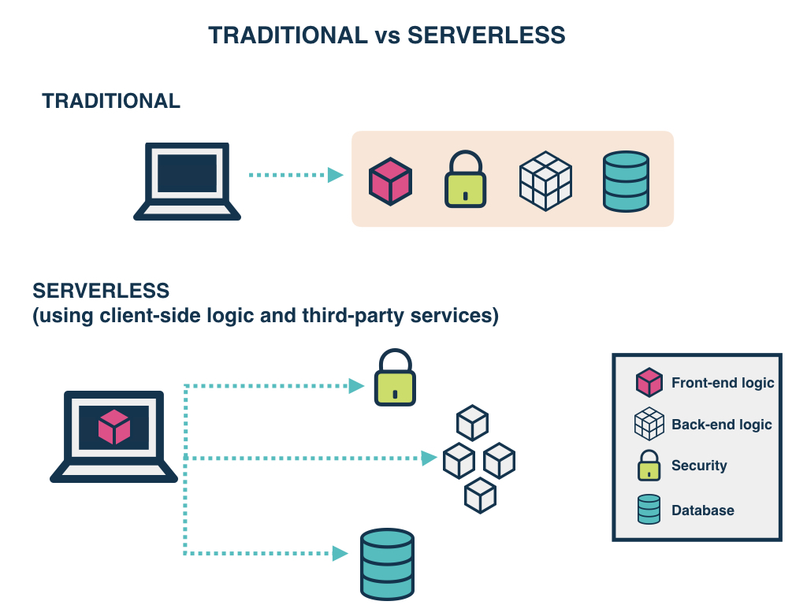

_Source: codeburst_

Avendo già in mente le funzionalità richieste al programma, si è deciso di realizzare per prima cosa il back-end, definendo subito i servizi funzionanti che verranno utilizzati dal modulo di front-end nella fase successiva. In un contesto reale normalmente le due parti del sofware verrebbero sviluppate contemporaneamente per garantire una maggiore velocità di risposta al cliente.

Come paradigma di programmazione è stato scelto quello _serverless_, così come anche il provider cloud, AWS Lambda, che implementa lo stesso.

> _serverless_ : la responsabilità della gestione dell' infrastruttura server viene affidata totalmente al provider, cosicchè il programmatore può occuparsi dell'applicazione, che viene eseguita e scalata automaticamente. Con questo metodo si riducono i costi, grazie all'eliminazione degli oneri di gestione ma soprattutto perchè le tariffe sono calcolate in base ai tempi di elaborazione del programma in esecuzione.

Questo significa che l'applicazione viene suddivisa in tante funzioni, ciascuna delle quali corrispondente ad un URL e più precisamente ad una risorsa che il server dovrà restituire, elaborata dalla funzione stessa.

AWS fornisce il servizio API Gateway, la quale si occupa sostanzialmente di ricevere le richieste dal client ed inoltrarle alla funzione desiderata, dopo eventuali controlli concernenti l'autenticazione o il dominio di provenienza, con grande vantaggio per la sicurezza e i costi, e di spedire la risposta.

Quando una chiamata riesce a passare API Gateway, viene invocata e caricata in memoria una funzione lambda che si occuperà dell'elaborazione. Successivamente, la funzione può rimanere in cache fino a 5 minuti, per poi essere ibernata se non riceve più richieste.

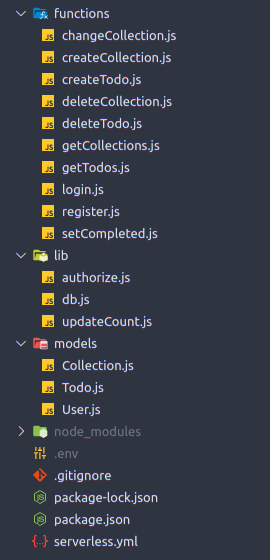

_struttura della cartella_

Il programma è strutturato in tre cartelle:

1. functions: raccoglie le funzioni lambda vere e proprie
1. lib: funzioni di supporto a quelle lambda
1. models: schemi dei documenti del database

Uno dei file più importanti del progetti è _serverless.yml_, il cui contenuto serve ad informare il framework [Serverless](serverless.com) riguardo a tutto ciò che gli serve per il deployment(provider, regione, runtime, funzioni etc.)

```yml
service: todo-webapp

provider:
  name: aws
  runtime: nodejs12.x
  memorySize: 128
  region: eu-south-1
```

Serverless è un framework che permette scrivere un'applicazione secondo il paradigma serverless e si occupa di impacchettare il codice ed inviarlo al provider, permettendoci di fatto di scrivere il programma in locale, testarlo e pubblicarlo in automatico.

```bash
#avviare il web server locale
sls offline start --skipCacheInvalidation

#credenziali provider
serverless config credentials --provider "il tuo provider" --key "latuakey" --secret "latuapassword"

#deployment su cloud
sls deploy
```

Nel file serverless.yml le varie funzioni si dichiarano con la seguente scrittura:

```yml
functions:
  register:
    handler: functions/register.handler
    events:
      - http:
          path: api/register
          method: post
          cors: true
```

Dove:

- register è il nome con cui verrà chiamata AWS Lambda
- handler è la funzione corrispondente nel codice
- events sono gli eventi che attivano la funzione, specificando l'url relativo, il metodo e l'attivazione di _cors_.

> _cors_ : "Cross-Origin Resource Sharing", un header HTTP che specifica quali domini di origine di una richiesta hanno la possibilità di effettuare richieste. Senza abilitare il cors solo le pagine appartenenti allo stesso dominio possono effettuare richieste HTTP.

Sintassi si base di una funzione lambda:

```javascript
module.exports.handler = async (event, context) => {
	//permette alla funzione di terminare anche se processi come la    connessione al database sono ancora in piedi
	context.callbackWaitsForEmptyEventLoop = false;

	//logica
};
```

> _event, context_ : event contiene informazioni riguardo all'invocatore(url, richiesta HTTP...), context contiene informazioni riguardo all'ambiente di esecuzione.

Tutte le funzioni lambda create a parte _register_ e _login_ sono protette da una funzione di autorizzazione, la quale si occupa di verificare che nell'intestazione sia presente il campo _Authorization_ contenente un token _JWT_. Il token JWT viene creato e spedito al client ogniqualvolta l'utente effettua correttamente il login, cioé autenticandosi. Successivamente solo i possessori del token hanno l'autorizzazione per ottenere risorse dagli altri endpoint HTTP.

> _JWT_ : standard sicuro e compatto per verificare autorizzazioni o scambiare informazioni basato su tre campi: Header(algoritmo usato), Payload(informazioni), Secret(firma). Header e Payload vengono convertiti in formato Base64URL e con l'algoritmo di codifica specificato(che può essere anche a chiave asimmetrica) viene generata una firma, il campo Secret, usando una chiave segreta nota solo ad uno degli interlocutori. I tre campi ottenuti vengono poi concatenati separandoli con un "." sono così pronti per l'invio.

Come provider per il database è stato scelto MongoDB Atlas, che offre il servizio DBaaS con un piano gratuito.

Per connettere il database alla server API si è utilizzato la libreria [mongooseJs](https://mongoosejs.com/)(tutti i package si trovano nel file packages.json), la quale offre un elevato grado di astrazione per effettuare operazioni su DB.

Per connettersi al database:

```javascript
const mongoose = require("mongoose");
require("dotenv").config();

//variabile booleana per determinare lo stato della connessione, in quanto può essere stata messa in cache(e quindi non vogliamo riconnetterci)
let isConnected;

module.exports = connectToDB = async () => {
  if (isConnected) {
    //se già connessa dà l'ok
    return Promise.resolve;
  }
  //avvio nuova connessione
  const db = await mongoose.connect(process.env.DB_URL, {
    useNewUrlParser: true,
    useUnifiedTopology: true,
  });
  isConnected = db.connections[0].readyState;
};

});
```

> process.end.DB_URL : è una variabile di sistema che non è presente nel codice del programma perché contiene informazioni sensibili : lo username e la password dell'account MongoDB Atlas. Per crearla si inserisce in un file denominato ".env" il nome della variabile="valore della variabile"

Mongoose funziona attraverso gli schemi(Schema), che non sono altro che le collezioni di MongoDB nei quali sono specificate le caratteristiche dei singoli documenti.
Nel presente progetto sono inclusi nella cartella _models_.
Un esempio di Schema per un account utente:

```javascript
const UserSchema = new mongoose.Schema({
	username: String,
	password: String,
});

module.exports = mongoose.model("User", UserSchema);
```

Dopo aver definito gli schemi sarà possibile effettuare query attraverso di loro, ecco alcuni esempi:

```javascript
//ottenere tutti gli oggetti dalla collezione Collection:
let collections = await Collection.find();

//creare un nuovo oggetto di tipo Collection e salvarlo nella corrispondente collezione
let collection = new Collection({
	name: name,
	count: 0,
});
await collection.save();

//eliminare un oggetto Collection in base all'id
await Collection.findByIdAndRemove(event.pathParameters.id);
```

Cifrazione delle password:

```javascript
//creazione hash della password + salt(10) per maggiore sicurezza
const hashedPassword = await bcrypt.hash(json.password, 10);
```

Innanzitutto viene creato un hash della password lungo 40 byte con l'algoritmo bcrypt, scegliendo come fattore di costo(complessità algoritmo) 10.
Automaticamente bcrypt una stringa casuale, il sale, che serve principalmente a differenziare gli hash di password uguali e salvaguardare gli utenti in caso di attacchi a forza bruta. Il sale, essendo random, si rivela inoltre ottimo contro gli attacchi a rainbow table, in cui vengono confrontati gli hash rubati con una tabella di stringa già decriptate.

### Front-end

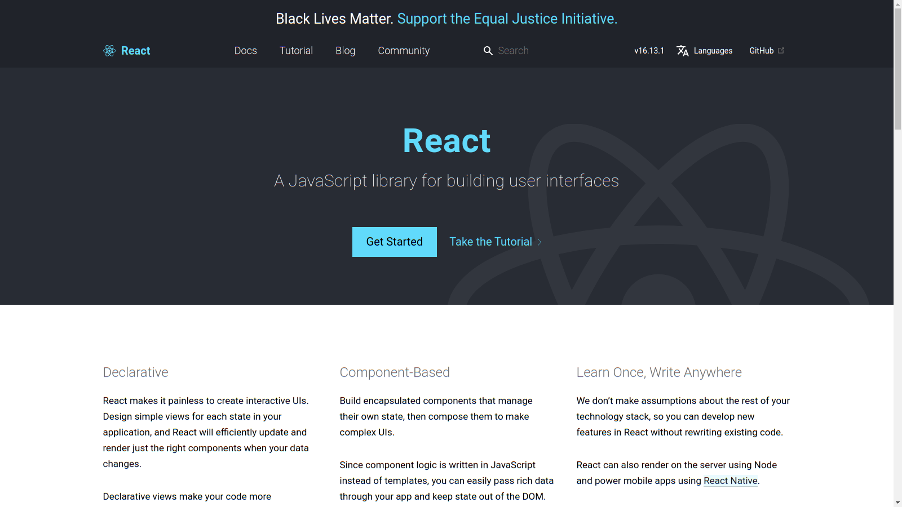

_Source: React_

Il front-end dell'applicazione, come descritto prima, consiste in una single-page-application. Tra gli UI framework basati su NodeJs è stato scelto React sia perché popolare(e quindi si può ottenere tanto aiuto dalla community) sia perchè già di mia conoscenza, permettendomi di risparmiare tempo.

React tratta l'applicazione come un albero di componenti, ciascuna delle quali è una funzione/classe Javascript riutilizzabile che descrive sia il suo aspetto(mediante tag _JSX_), sia il suo comportamento nonché lo stato.

Quando lo stato di un componente subisce un cambiamento, viene azionato un render solo del componente stesso, garantendo interattività e prestazioni.

I vari componenti per dialogare di base sfruttano i props, cioè dati che vengono passati dal componente padre al componente figlio come parametri nel tag di creazione e che il figlio dichiara nella sua firma.

> _JSX_ : estensione del linguaggio Javascript che incorpora il markup nella logica

```html
const element =
<h1>Hello, world!</h1>
;
```

La sintassi di base di un componente in React è la seguente:

```javascript
import React from "react";

const App = () => {
	//eventuali stati
	//eventuali funzioni
	return <div></div>;
};
```

E necessita di un componente root per essere renderizzato:

```javascript
import React from "react";
import ReactDOM from "react-dom";
import App from "./App";

ReactDOM.render(
	<React.Fragment>
		<App />
	</React.Fragment>,
	document.getElementById("root")
);
```

Per avere un aspetto accattivante, è stato seguito il linguaggio di design di [Ant Design](https://ant.design/), la quale offre anche componenti per React


- public, contenente i loghi e index.html che verrà popolato dal contenuto html derivato dalla compilazione del codice Javascript estrapolando i tag JSX.

- src

  - components, contenente le funzioni che verranno renderizzate su schermo

  - contexts, funzioni speciali che hanno il compito di fornire dati e/o metodi ad altre funzioni. Sono richiesti quando si vogliono passare gli stessi dati a più componenti senza incorrere nel _props drilling_

  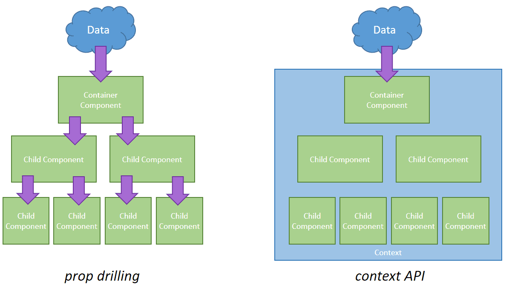

  _Source: carlrippon_

  - res, immagini di sfondo

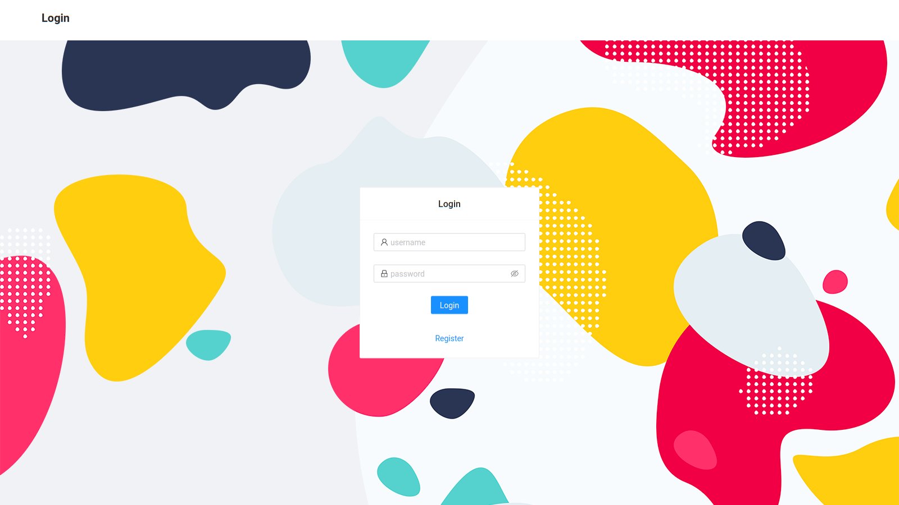
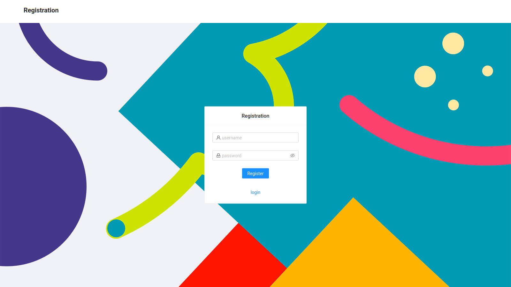
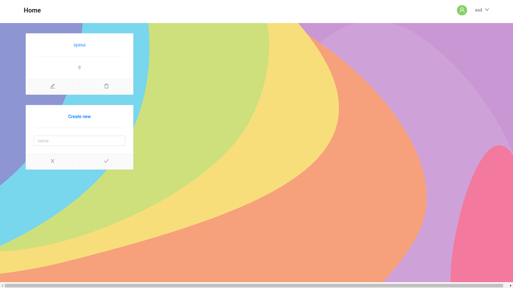


I cambiamenti di pagina sono gestiti dal componente _BrowserRouter_, la quale si occupa di nascondere componenti e renderizzare quelli giusti in base all'URL.

---

## Testing e Debugging

Per effettuare i vari test occorsi durante lo sviluppo mi sono avvalso del web-server locale di NodeJs, richiamabile attraverso:

```bash
#back-end
sls offline start --skipCacheInvalidation

#front-end
npm run start
#(uno script dichiarato in package.json)
```

Per testare le funzionalità della Rest API in fase di sviluppo mi sono avvalso della utility gratuita [Postman](https://www.postman.com/) per simulare richieste HTTP comprendenti vari Header e Body.

Quando al front-end, mi sono affidato estensivamente di [Chrome Dev tools](https://developers.google.com/web/tools/chrome-devtools) incorporato nel browser per effettuare debugging di script Javascript e moduli CSS.

Segnalo anche [React Developer Tools](https://chrome.google.com/webstore/detail/react-developer-tools/fmkadmapgofadopljbjfkapdkoienihi), un'estensione per browser Chromium utile per monitorare gli stati dei componenti React.

Un aiuto importante è stato dato dai feedback dei miei beta-tester, che mi hanno permesso di inquadrare meglio il punto di vista degli utenti e migliorare le parti della UI poco intuitive, facendomi notare anche alcune mancanze, contribuendo a rendere migliore la User Experience.

---

## Deployment

- Rest API -> [AWS Lambda](https://chrome.google.com/webstore/detail/react-developer-tools/fmkadmapgofadopljbjfkapdkoienihi)

- SPA -> [Heroku](https://www.heroku.com/)

- Database -> [MongoDB Atlas](https://www.mongodb.com/cloud/atlas)

Tutti e tre i cloud provider qui sopra prevedono piano gratuiti con limiti di utilizzo che ho sfruttato per realizzare il presente progetto.

---

## Criticità e miglioramenti futuri

Il linguaggio di design utilizzato, Ant Design, è orientato principalmente verso la rappresentazione desktop, e ciò consegue che la UI prodotta è solo parzialmente responsive. Infatti l'utilizzo della app risulta poco sgradevole da dispositivo mobile.

Esiste una versione di Ant Design, Ant Design mobile, progettato per gli schermi più piccoli ma ciò significa che bisogna sviluppare due versioni separate per la stessa app che io, per motivi di tempo, non ho potuto fare.

Scegliere una libreria UI più responsive, come Material UI o Bootstrap avrebbe portato a maggiore flessibilità.

Un altro miglioramento che si potrebbe apportare è l'introduzione di un logo, che per capacità tecniche non sono riuscito a realizzare con sufficiente soddisfazione.

Oltretutto, le animazioni del sito sono piuttosto improvvisi, ed elementi di caricamento come gli skeleton o un sistema di animazione come Framer Motion avrebbero portato ad una User Experience più gradevole e professionale.

Tutte le precedenti criticità mostrano come sia necessario e vantaggioso collaborare in un team di sviluppatori, possibilmente coadiuvati da personale con conoscenze di design.
