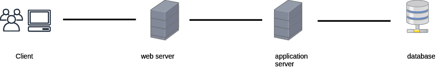
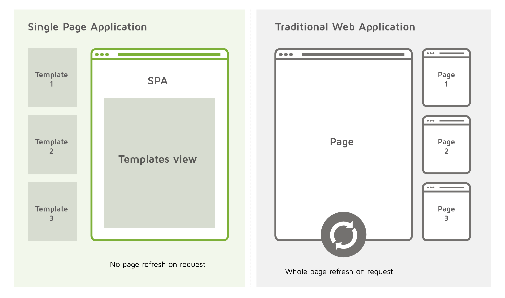

<!--  -->

# Elaborato esame di stato 2019/20

> Zhu Yihui 5A Informatica

# Progetto: **Todo**

- Analisi
- Progettazione
- Implementazione
- Testing
- Criticità e miglioramenti futuri

---

## Analisi

Per l'esame di stato è stato scelto di approfondire gli argomenti riguardanti:

- sviluppo di applicazioni web
- architettura client-server di livello 3
- virtualizzazione.

A tal proposito è stato realizzato un progetto consistente in una webapp serverless che implementa gli argomenti prima elencati finalizzata alla gestione delle faccende ed impegni familiari da sbrigare.

I vari task possono essere raccolti e organizzati in collezioni divise per categoria e sono mostrati in una tabella, da cui l'utente può crearne di nuovi, segnarne l'adempimento od eliminarlo.

Tutti i dati sono salvati in cloud, inoltre i task salvati mostrano anche l'orario di creazione e l'utente.

La riservatezza delle informazioni è garantita da un sistema di autenticazione e autorizzazione basata su password cifrate.

---

## Progettazione

- Architettura generale
- Struttura front-end, web server
- Struttura back-end, application server
- Database
- User interface design

<!--  -->

### Architettura generale

L'architettura dell'applicazione è quella _client-server tier 3_,in cui il software viene scomposto in tre livelli o strati:

1. Presentazione(interfaccia utente)
1. Applicazione(funzionalità)
1. Dati(database)

Il vantaggio di questo schema è che la complessità della realizzazione e del debugging diminuisce, perchè il programma viene diviso in moduli più semplici.

Non solo, il singolo livello può essere aggiornato indipendentemente dagli altri, garantendo scalabilità e riusabilità del codice.

Infine, quando ciascun livello viene ospitato su macchine hardware differenti duplicate, viene migliorata la disponibilità, perché il carico di lavoro viene distribuito su altri nodi in casi di fallimento di uno.

### Struttura front-end, web server

<!--  -->

_Source: Digital Clarity Group_

La parte di presentazione è costituita da una single-page-application, cioè una applicazione costituita da una solo pagina statica che ottiene i dati attraverso chiamate asincrone al server e sfrutta la renderizzazione condizionale per la parte ottenere dinamicità. Una webapp o un sito web tradizionale al contrario richiedono che il server spedisca al client intere pagine html, con grande dispendio di tempo e banda.

Ciò le permette di non generare caricamenti della pagina quando si cambiano schermate o si richiedono contenuti a parte quello iniziale, il tutto a favore della velocità e dell'esperienza d'uso.

### Struttura back-end, application server

<!--  -->

Come servizio di back-end è stato scelto una Rest(Representational State Transfer) API, ovvero un API basata sul protocollo HTTP, quindi _stateless_, che associa ad un URL una risorsa(che viene restituita sottoforma di JSON o XML), che il richiedente del servizio deve richiedere inviando una richiesta HTTP specificandone la tipologia, GET POST DELETE etc.

> _stateless_ : il server non crea sessioni, cioè non memorizza il contesto del client. Ciascuna richiesta deve quindi contenere tutte il necessario per il buon fine della chiamata.

### Database

<!-- ; -->

Come base di dati per memorizzare l'elenco degli utenti e la lista delle faccende è stato deciso di usare il un DBMS NoSQL a documenti.

NoSQL sta per Not Only SQL e indica un insieme di DBMS che non utilizzano né il linguaggio SQL né il modello relazionale, nati allo scopo di servire delle specifiche necessità che i rigidi schemi delle tabelle non possono soddisfare.

Ci sono per esempio database _chiave/valore_, particolarmente veloce e adatto a servizi di messaggistica istantenea, _a grafo_, tipici dei social network, _in memoria_, per videogiochi online in quanto offrono tempi di latenza ridottissimi. In genere i DBMS NoSQL permettono la scalabilità orizzontale, cioè aggiungere nuovi nodi al gruppo di elaboratori(molto vantaggioso), contro la scalabilità verticale, ovvero potenziare il singolo elaboratore.

I database _a documenti_ memorizzano i dati sottoforma di documenti raccolti a loro volta in collezioni(le tabella dei RDBMS), l'equivalente del record nei database relazionali, di fatto oggetti JSON, caratterizzati da uno schema libero e mutabile, che possono essere messi in relazione o contenerne altri documenti.

Il motivo della scelta è dovuto alla semplicità di programmazione, in quanto un documento del database ha la stessa struttura nel codice del programma.
Lo schema non fisso inoltre garantisce flessibilità e scalabilità nel futuro.
Infine, siccome i dati non sono normalizzati, le prestazioni sono migliori che nei RDBMS in quanto quest'ultimi normalmente necessitano di effettuare ed attendere l'operazione JOIN tra le tabelle per ottenere il risultato richiesto, a scapito di eventuali ridondanze.

---

## Implementazione

- User Interface
- Rest API
- Database
