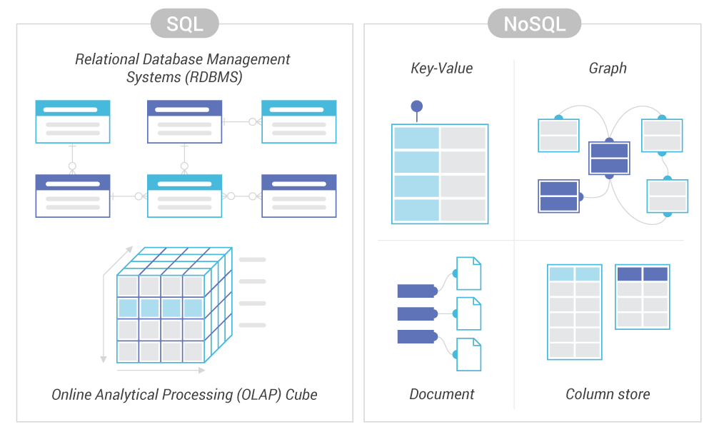

<!--  -->

# Elaborato esame di stato 2019/20

> Zhu Yihui 5A Informatica

# Progetto: **Todo**

- Analisi
- Progettazione
- Implementazione
- Testing
- Criticità e miglioramenti futuri

---

## Analisi

Per l'esame di stato è stato scelto di approfondire gli argomenti riguardanti:

- sviluppo di applicazioni web
- architettura client-server di livello 3
- virtualizzazione.

A tal proposito è stato realizzato un progetto consistente in una webapp che implementa gli argomenti prima elencati finalizzata alla gestione delle faccende ed impegni familiari da sbrigare.

I vari task possono essere raccolti e organizzati in collezioni divise per categoria e sono mostrati in una tabella, da cui l'utente può crearne di nuovi, segnarne l'adempimento od eliminarlo.

Tutti i dati sono salvati in cloud, inoltre i task creati mostrano anche l'orario di creazione e l'utente.

La riservatezza delle informazioni è garantita da un sistema di autenticazione e autorizzazione basata su password cifrate.

---

## Progettazione

- Architettura generale
- Struttura front-end, web server
- Struttura back-end, application server
- Database
- User interface design

<!--  -->

### Architettura generale

L'architettura dell'applicazione è quella _client-server tier 3_,in cui il software viene scomposto in tre livelli o strati:

1. Presentazione(interfaccia utente)
1. Applicazione(funzionalità)
1. Dati(database)

Il vantaggio di questo schema è che la complessità della realizzazione e del debugging diminuisce, perchè il programma viene diviso in moduli più semplici.

Non solo, il singolo livello può essere aggiornato indipendentemente dagli altri, garantendo scalabilità e riusabilità del codice.

Infine, quando ciascun livello viene ospitato su macchine hardware differenti duplicate, viene migliorata la disponibilità, perché il carico di lavoro viene distribuito su altri nodi in casi di fallimento di uno.

### Struttura front-end, web server

<!--  -->

_Source: Digital Clarity Group_

La parte di presentazione è costituita da una single-page-application, cioè una applicazione costituita da una solo pagina statica che ottiene i dati attraverso chiamate asincrone al server e sfrutta la renderizzazione condizionale per la parte ottenere dinamicità. Una webapp o un sito web tradizionale al contrario richiedono che il server spedisca al client intere pagine html, con grande dispendio di tempo e banda.

Ciò le permette di non generare caricamenti della pagina quando si cambiano schermate o si richiedono contenuti a parte quello iniziale, il tutto a favore della velocità e dell'esperienza d'uso.

### Struttura back-end, application server

<!--  -->

Come servizio di back-end è stato scelto una Rest(Representational State Transfer) API, ovvero un API basata sul protocollo HTTP, quindi _stateless_, che associa ad un URL una risorsa(che viene restituita sottoforma di JSON o XML), che il richiedente del servizio deve richiedere inviando una richiesta HTTP specificandone la tipologia, GET POST DELETE etc.

> _stateless_ : il server non crea sessioni, cioè non memorizza il contesto del client. Ciascuna richiesta deve quindi contenere tutte il necessario per il buon fine della chiamata.

### Database

<!-- ; -->

Come base di dati per memorizzare l'elenco degli utenti e la lista delle faccende è stato deciso di usare il un DBMS NoSQL a documenti.

NoSQL sta per Not Only SQL e indica un insieme di DBMS che non utilizzano né il linguaggio SQL né il modello relazionale, nati allo scopo di servire delle specifiche necessità che i rigidi schemi delle tabelle non possono soddisfare.

Ci sono per esempio database _chiave/valore_, particolarmente veloce e adatto a servizi di messaggistica istantenea, _a grafo_, tipici dei social network, _in memoria_, per videogiochi online in quanto offrono tempi di latenza ridottissimi. In genere i DBMS NoSQL permettono la scalabilità orizzontale, cioè aggiungere nuovi nodi al gruppo di elaboratori(molto vantaggioso), contro la scalabilità verticale, ovvero potenziare il singolo elaboratore.

I database _a documenti_ memorizzano i dati sottoforma di documenti raccolti a loro volta in collezioni(le tabella dei RDBMS), l'equivalente del record nei database relazionali, di fatto oggetti JSON, caratterizzati da uno schema libero e mutabile, che possono essere messi in relazione o contenerne altri documenti.

Il motivo della scelta è dovuto alla semplicità di programmazione, in quanto un documento del database ha la stessa struttura nel codice del programma.
Lo schema non fisso inoltre garantisce flessibilità e scalabilità nel futuro.
Infine, siccome i dati non sono normalizzati, le prestazioni sono migliori che nei RDBMS in quanto quest'ultimi normalmente necessitano di effettuare ed attendere l'operazione JOIN tra le tabelle per ottenere il risultato richiesto, a scapito di eventuali ridondanze.

<!--  -->

### User interface design

<!--  -->

Si è iniziati con la progettazione dell'interfaccia utente disegnando i primi wireframe su carta, successivamente grazie a [uizard](https://uizard.io/) si è potuto prototipare una prima idea del progetto.

La fase di prototipazione è essenziale per lo sviluppo di un software dotato di interfaccia utente perchè permette innanzitutto di decidere anzitempo la struttura della UI, invitare altre persone a valutarne la bontà, per poi in fase di programmazione avere un riferimento sicuro su cui basarsi.

---

## Implementazione

Sia il server che la SPA vengono eseguite dal runtime [NodeJs](nodejs.org), il quale mi ha permesso di scrivere il programma usando diversi fantastici framework che descriverò in un secondo momento, caratterizzato inoltre da elevate prestazioni di esecuzione.

Di fatto è una versione del motore V8 di Chromium che permette di far eseguire codice Javascript fuori da un browser.

Come packet manager NodeJs usa npm. Per installare un package basta digitare nel terminale

```bash
npm i "nomedelpackage"
```

- Back-end
- Front-end

### Rest API e database

<!--  -->

Avendo già in mente le funzionalità richieste al programma, si è deciso di realizzare per prima cosa il back-end, definendo subito i servizi funzionanti che verranno utilizzati dal modulo di front-end nella fase successiva. In un contesto reale normalmente le due parti del sofware verrebbero sviluppate contemporaneamente per garantire una maggiore velocità di risposta al cliente.

Come paradigma di programmazione è stato scelto quello _serverless_, così come anche il provider cloud, AWS Lambda, che implementa lo stesso.

> _serverless_ : la responsabilità della gestione dell' infrastruttura server viene affidata totalmente al provider, cosicchè il programmatore può occuparsi dell'applicazione, che viene eseguita e scalata automaticamente. Con questo metodo si riducono i costi, grazie all'eliminazione degli oneri di gestione ma soprattutto perchè le tariffe sono calcolate in base ai tempi di elaborazione del programma in esecuzione.

Questo significa che l'applicazione viene suddivisa in tante funzioni, ciascuna delle quali corrispondente ad un URL e più precisamente ad una risorsa che il server dovrà restituire, elaborata dalla funzione stessa.

AWS fornisce il servizio API Gateway, la quale si occupa sostanzialmente di ricevere le richieste dal client ed inoltrarle alla funzione desiderata, dopo eventuali controlli concernenti l'autenticazione o il dominio di provenienza, con grande vantaggio per la sicurezza e i costi, e di spedire la risposta.

Quando una chiamata riesce a passare API Gateway, viene invocata e caricata in memoria una funzione lambda che si occuperà dell'elaborazione. Successivamente, la funzione può rimanere in cache fino a 5 minuti, per poi essere ibernata se non riceve più richieste.


_struttura della cartella_

Il programma è strutturato in tre cartelle:

1. functions: raccoglie le funzioni lambda vere e proprie
1. lib: funzioni di supporto a quelle lambda
1. models: schemi dei documenti del database

Uno dei file più importanti del progetti è _serverless.yml_, il cui contenuto serve ad informare il framework [Serverless](serverless.com) riguardo a tutto ciò che gli serve per il deployment(provider, regione, runtime, funzioni etc.)

```yml
service: todo-webapp

provider:
  name: aws
  runtime: nodejs12.x
  memorySize: 128
  region: eu-south-1
```

Serverless è un framework che permette scrivere un'applicazione secondo il paradigma serverless e si occupa di impacchettare il codice ed inviarlo al provider, permettendoci di fatto di scrivere il programma in locale, testarlo e pubblicarlo in automatico.

```bash
# avviare il web server locale
sls offline start --skipCacheInvalidation

#credenziali provider
serverless config credentials --provider "il tuo provider" --key "latuakey" --secret "latuapassword"

#deployment su cloud
sls deploy
```

Nel file serverless.yml le varie funzioni si dichiarano con la seguente scrittura:

```yml
functions:
  register:
    handler: functions/register.handler
    events:
      - http:
          path: api/register
          method: post
          cors: true
```

Dove:

- register è il nome con cui verrà chiamata AWS Lambda
- handler è la funzione corrispondente nel codice
- events sono gli eventi che attivano la funzione, specificando l'url relativo, il metodo e l'attivazione di _cors_.

> _cors_ : "Cross-Origin Resource Sharing", un header HTTP che specifica quali domini di origine di una richiesta hanno la possibilità di effettuare richieste. Senza abilitare il cors solo le pagine appartenenti allo stesso dominio possono effettuare richieste HTTP.
